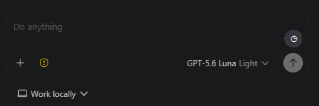
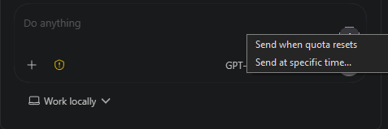

# Codex Scheduler

Schedule a prompt that is already typed in the official OpenAI Codex VS Code chat.



## What it does

- Send when your Codex quota resets
- Send at a specific time
- Send after a delay such as `in 20m` or `in 2h`
- Keeps the prompt in the same Codex conversation



## Install

1. Install the official OpenAI Codex VS Code extension.
2. Clone this repo.
3. Run:

```bash
npm install
npm run package
```

4. In VS Code, open **Extensions** → `...` → **Install from VSIX...**
5. Select `codex-scheduler.vsix`.

## Use

1. Open an existing Codex conversation.
2. Type your next prompt, but do not send it.
3. Click the clock button above Codex's Send button.
4. Choose **Send when quota resets** or **Send at specific time...**.

For scheduled time, enter `HH:MM` in 24-hour format or a delay such as `in 20m` or `in 2h`.


## Notes

- In a brand-new chat, send one normal message first before scheduling the next prompt.
- **Send when quota resets** is one-shot. It turns off after the scheduled prompt is sent.
- VS Code and the computer currently need to stay awake for scheduled prompts to run.
